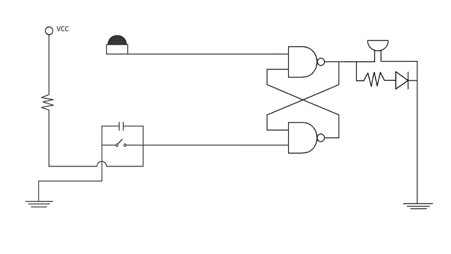
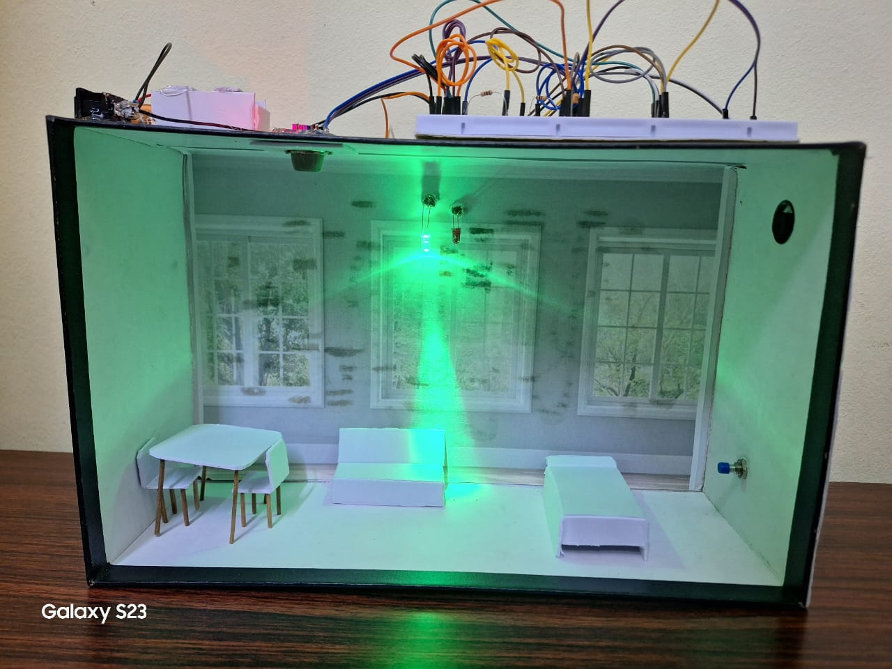

# Smoke Detection System with Auto Cut-Off

A hardware-based smoke detection system designed to provide early hazard detection and automatic alert mechanisms for improved safety in residential and industrial environments.

---

## 📌 Overview

This project focuses on developing a reliable smoke detection system using the MQ2 gas sensor to detect smoke and flammable gases in the environment. Upon detecting hazardous levels, the system triggers an automatic alert through a buzzer and LED.

An SR latch circuit is implemented to maintain the alert state until manually reset, ensuring consistent safety even after transient smoke exposure.

---

## 🛠️ Components Used

- MQ2 Smoke Sensor  
- SR Latch (NAND Gates)  
- LED  
- Buzzer  
- Resistors  
- 9V Battery  
- Breadboard and Jumper Wires  

---

## ⚙️ Working Principle

The MQ2 sensor detects the presence of smoke or flammable gases and outputs an analog signal proportional to gas concentration.

This signal is fed to an SR latch circuit which:
- Activates LED and buzzer when smoke is detected  
- Maintains alert state until reset  
- Ensures continuous warning even after temporary smoke disappearance  

---

## 🔌 Circuit Diagram

---

## 🧪 Hardware Implementation

---

## 📄 Project Report
Full documentation available here:  
[Smoke_Detection_AutoCutoff_Report.pdf](Smoke_detection_with_auto_cutoff_report.pdf)

---

## 📈 Applications
- Residential Fire Safety  
- Industrial Hazard Detection  
- Commercial Safety Systems  
- Emergency Alert Systems  
